# 实体化数据

## 1. 概述

### 1.1 目的

直接从游戏中提取的数据大多数的情况下仅含有相关主键，例如

```json
"skillDetails": [
  {
    "efficacyId": "ef-score_get-2800-chart_dependence",
    "triggerId": ""
  },
  {
    "efficacyId": "ef-vocal_up-5-target-vocal_higher-1-13",
    "triggerId": ""
  }
]
```

在上例中，一个 `skillDetails` 拥有多个 `efficacy`（一个技能拥有多个效果）。  
但 `skillDetails` 仅格纳了 `efficacyId`，而非 `efficacy` 本身。  
如果不对原始数据进行改造，那么在需要使用 `efficacy` 时，必须每次都从 ID 去检索才能获得它的实体。  
对于使用次数较少的情况，这样做并无大碍。但 `efficacy` 是一个被使用十分频繁的实体，如果每次使用前都需要检索，会造成大量的性能浪费。  
因此，需要对 `skillDetails` 进行改造，使其拥有 `efficacy` 实体本身而非 ID。  

改造后例：

```json
"skillDetails": [
  {
    "efficacyId": "ef-score_get-2800-chart_dependence",
    "triggerId": "",
    "efficacy": {
      "id": "ef-score_get-2800-chart_dependence",
      "name": "スコア獲得",
      "type": 1,
      "description": "280%のスコア獲得",
      "shortDescription": "",
      "grade": 0,
      "maxGrade": 0,
      "skillTargetId": ""
    },
  },
  {
    "efficacyId": "ef-vocal_up-5-target-vocal_higher-1-13",
    "triggerId": "",
    "efficacy": {
      "id": "ef-vocal_up-5-target-vocal_higher-1-13",
      "name": "ボーカルの高い1人にボーカルアップ",
      "type": 14,
      "description": "ボーカルが高い1人に5段階ボーカル上昇効果[13ビート]",
      "grade": 5,
      "maxGrade": 20,
      "skillTargetId": "target-vocal_higher-1",
      "shortDescription": ""
    }
  }
],
```

这样，将 `efficacy` 格纳入 `skillDetails` （内存）中，以空间换时间的思路，在使用 `efficacy` 时便可直接获取。

### 1.2 输入

各类 ID。

### 1.3 输出

可供其他模块直接使用的数据实体。

### 1.4 定义

| 文件名                    | 函数&方法名                                                      | 输入                  | 输出 |
| ---------------------- | ----------------------------------------------------------- | ------------------- | -- |
| card\_repository.ts    | getCard(id: string): WapCard                             | cardId              |    |
| card\_repository.ts    | getCardParameter(id: string): CardParameter                 | cardParameterId     |    |
| card\_repository.ts    | getCardRarity(rarity: number): CardRarity                   |                     |    |
| skill\_repository.ts   | getSkill(id: string): WapSkill                           | skillId             |    |
| skill\_repository.ts   | getSkillLevel(id: string, level: number): WapSkillLevel  | skillId, skillLevel |    |
| skill\_repository.ts   | getSkillEfficacy(id: string): WapSkillEfficacy           | skillEfficacyId     |    |
| quest\_repository.ts   | getQuest(id: string): WapQuest                           | questId             |    |
| quest\_repository.ts   | getMusicChartPattern(id: string): WapMusicChartPattern   | musicChartPatternId |    |
| quest\_repository.ts   | getLiveAbility(liveBonusGroupId: string): WapLiveAbility | liveBonusGroupId    |    |
| setting\_repository.ts | getSetting(): Setting                                       |                     |    |

### 1.5 文件结构

```text
project
  └─📁db
    └─ 📁repository
        └─ card_repository.ts
        └─ skill_repository.ts
        └─ ...
    └─ 📁wrapper
        └─ card_wrapper.ts
        └─ skill_wrapper.ts
        └─ ...
    └─ 📁dao
        └─ card_dao.ts
        └─ skill_dao.ts
        └─ ...
```

- 📁dao
  - 负责从数据库（JSON）获取原始数据，并处理未找到数据的情况。
  - 直接与数据库（JSON）交互的唯一场所，其他地方需要访问数据库时必须通过此包。
- 📁wrapper
  - 负责将从 dao 获取到的原始数据组装成可供上层使用的实体。
  - 若数据本身不需要被组装，直接返回原始数据即可（但不可被省略）。
- 📁repository
  - 将 wrapper 组装完成后的 object 返回给上层调用者。
  - 为外部提供调用入口函数，外部只能调用此文件夹内的函数。
  - 以 ID 为 key，存放已被检索过的 object，提高二次检索效率。


### 1.6 与其他机能的关联性

见 [overall.svg](./overall.drawio.svg)

### 1.7 规范性约定

- 数据库文件（JSON）必须全部原封不动来自游戏内提取，禁止直接修改。
- 改造后的实体全部以 `Wap` 作为前缀。未修改的实体不加前缀。
- 调用规范
  如图依层级调用。
  ```mermaid
  flowchart LR
  repo["repository"] --> wrapper["wrapper"] --> dao["dao"]
  ```
  禁止越级调用。

## 2. 处理详细

### 2.1 制约条件

- 执行时机：被调用时
- 前置条件：无

### 2.2 异常处理

若发生异常，返回 `undefined` 并在 console 中打印详细错误信息。

### 2.3 处理详细


